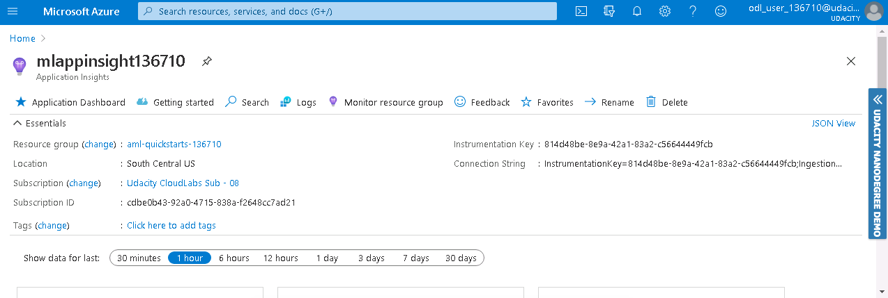

# Heart Failure Prediction - Capstone Project For Udacity's Azure ML Nanodegree


## Table of content
* [Overview](#overview)
* [Dataset](#dataset)
  - [Overview](#overview)
  - [Task](#task)
  - [Access](#access)
* [Automated ML](#automated-ml)
  - [Results](#results)
* [Hyperparameter Tuning](#hyperparameter-tuning)
  - [Results](#results-1)
* [Model Deployment](#model-deployment)
* [Screen Recording](#screen-recording)
* [Standout Suggestions](#standout-suggestions)


## Overview
This project is part of the Udacity's Azure ML Nanodegree. In this project, we were asked to use a dataset of our choice to solve a Machine Learning problem using Azure ML. To do so, we need to train models using AutoML as well as Hyperdrive, then we choose the best model, deploy it and consume it.


## Dataset

### Overview
For this project, I used the [Heart Failure dataset](https://www.kaggle.com/andrewmvd/heart-failure-clinical-data) from Kaggle. 

Heart failure is a common event caused by CVDs and this dataset contains 12 features that can be used to predict mortality by heart failure.

Column | Description
------ | -----------
age | Age of the patient
anemia | Decrease of red blood cells or hemoglobin (boolean)
creatinine_phosphokinase | Level of the CPK enzyme in the blood (mcg/L)
diabetes | If the patient has diabetes (boolean)
ejection_fraction | Percentage of blood leaving the heart at each contraction (percentage)
high_blood_pressure | If the patient has hypertension (boolean)
platelets | Platelets in the blood (kiloplatelets/mL)
serum_creatinine | Level of serum creatinine in the blood (mg/dL)
serum_sodium | Level of serum sodium in the blood (mEq/L)
sex | Woman or man (binary)
smoking | If the patient smokes or not (boolean)
time | Follow-up period (days)
DEATH_EVENT | If the patient deceased during the follow-up period (boolean)

### Task
The problem is to predict the value of the DEATH_EVENT target column. This is a classification problem (1: death, 0: no death).

### Access
In Azure ML Studio, I registered the dataset from local files. I have the .csv file in my github repository and I downloaded it in the VM. For the train.py file I usef the link to my repo to create a Tabular Dataset.


## Automated ML
For the Compute Target, I used a 'STANDARD_D2_V2' vm_size with max_nodes=4. For the AutoML Configuration, I used the following settings :

```python
    automl_settings = {
        "experiment_timeout_minutes": 15,
        "iterations": 40,
        "max_concurrent_iterations": 4,
        "n_cross_validations": 3,
        "primary_metric" : 'accuracy'
    }
    automl_config = AutoMLConfig(compute_target=compute_target,
                                 task = "classification",
                                 training_data=dataset,
                                 label_column_name="DEATH_EVENT",
                                 enable_early_stopping= True,
                                 debug_log = "automl_errors.log",
                                 **automl_settings
                                )
```

Let me explain the reasoning behind my choices for the AutoML Config:
* **experiment_timeout_minutes**: I chose 15 minutes as the maximum amount of time the experiment can takee before it terminates because I have a small dataset with only 299 entries.
* **max_concurrent_iterations**: Represents the maximum number of iterations that would be executed in parallel. The default value is 1.
* **n_cross_validations**: To avoid overfitting, we need to user cross validation.
* **primary_metric**: Accuracy.
* **task**: Classification, since we want to have a binary prediction (0 or 1).

### Results
Azure AutoML tried different models such as : RandomForests, BoostedTrees, XGBoost, LightGBM, SGDClassifier, VotingEnsemble, etc. 

The best model was a Voting Ensemble that has Accuracy=0.8595286195286196. 

Ensemble learning improves machine learning results and predictive performance by combining multiple models as opposed to using single models. The Voting Ensemble model predicts based on the weighted average of predicted class probabilities.

Parameters | Values
---------- | ------
bootstrap | False
ccp_alpha | 0.0
class_weight | None
criterion | 'entropy'
max_depth | None
max_features | 0.8
min_child_samples | 22
min_child_weight | 1
min_split_gain | 0.2631578947368421
n_estimators | 50
n_jobs | 1
num_leaves | 104
objective | None
random_state | None
reg_alpha | 0
reg_lambda | 0.42105263157894735
silent | True
subsample | 1
subsample_for_bin | 200000
subsample_freq | 0

**Improvements for autoML**

To improve it, I could've disabled early stopping, increase **experiment_timeout_minutes**, get more data as this dataset only had 299 entries, and also choose another **primary_metric** such as AUC instead of Accuracy.

*Figure 1-2: Run Details*


*Figure 3: Best Model*


## Hyperparameter Tuning
For Hyperparameter Tuning, I used the Logistric Regression algorithm from the SKLearn framework. There are two hyperparamters for this experiment:

**C** | The inverse regularization strength.
**max_iter** | The maximum iteration to converge for the SKLearn Logistic Regression.

I also used random parameter sampling to sample over a discrete set of values. Random parameter sampling is great for discovery and getting hyperparameter combinations that you would not have guessed intuitively, although it often requires more time to execute.

The parameter search space used for **C** is `[0.01, 0.1, 1.0, 10.0, 100.0]` and for **max_iter** is `[20, 50, 100, 120, 150]`

The [BanditPolicy](https://docs.microsoft.com/en-us/python/api/azureml-train-core/azureml.train.hyperdrive.banditpolicy?view=azure-ml-py) is based on slack factor/slack amount and evaluation interval. Bandit terminates runs where the primary metric is not within the specified slack factor/slack amount compared to the best performing run. This helps to improves computational efficiency.

```python
    # Create an early termination policy. This is not required if you are using Bayesian sampling.
    early_termination_policy = BanditPolicy(evaluation_interval=2, slack_factor=0.1)


    # Create the different params that you will be using during training
    param_sampling = RandomParameterSampling(
        {
            '--C': choice(0.01, 0.1, 1.0, 10.0, 100.0),
            '--max_iter': choice(20, 50, 100, 120, 150)
        }
    )


    # Create your estimator and hyperdrive config
    estimator = SKLearn(source_directory='./', 
                        entry_script='train.py',
                        compute_target=compute_target)

    hdr_config = HyperDriveConfig(
        estimator=estimator, 
        hyperparameter_sampling=param_sampling, 
        policy=early_termination_policy, 
        primary_metric_name='Accuracy', 
        primary_metric_goal=PrimaryMetricGoal.MAXIMIZE, 
        max_total_runs=20, 
        max_concurrent_runs=4
    )

```

### Results
HyperDrive tested many combinations of **C** and **max_iter** and the highest accuracy that our Logistic Regression Model acheived was **0.7888888888888889**. The hyperparamteres that were used by this model are:

Hyperparameter | Value
-------------- | -----
Regularization Strength (C) | 100
Max Iterations (max_iter) | 20

**Improvements for hyperDrive**

To improve it, I could've increased **max_total_runs** so that I can optimize the parameters more. I could also use a different primary metric to maximize, similar to the automl model. And finally, I could use **Bayesian sampling** insted of Random Sampling as it picks the next sample of hyperparameters, based on how the previous samples performed.

I retireved the yml file associated with the environment. Then, I retrieved the scoring script. It describes the input data that model will expect and passes it to the model for prediction and returns the results.

For deployment, I used Azure Container Instances with `cpu_cores = 1` and `memory_gb = 1`, and with **Authentication** and **Application Insights** enabled.

To consume the endpoint, I selected sample data from the dataframe, converted it to json format and passed it to the webservice with the following command :

```python
    # select samples from the dataframe
    test_data = df.sample(10)
    test_label = test_data.pop('DEATH_EVENT')

    # convert the records to a json data file
    data_json = test_data.to_dict(orient='records')

    data = json.dumps({'data': data_json})

    # get inference
    output = webservice.run(data)
```

The output I got was in this format : `{"result": [1, 0, 1, 1, 0, 1, 0, 0, 0, 0]}`

*Figure 4-5-6: Run Details*


*Figure 7: Best Model*


## Model Deployment
Based on the previous results, I chose the **Voting Ensemble** model as it has the best Accuracy out of the two. To successfully deploy the model, we must have an **InferenceConfig** and an **ACI Config**.

*Figure 8-9-10: Endpoint*


*Figure 11-12: Application Insights*



## Screen Recording


## Standout Suggestions
To improve this project in future, I can make the following improvements:

* Choose another primary metric like "AUC Weighted" or F1 Score.
* Choose another Classifier instead of Logistic Regression.
* Use another dataset with more entries.
* Train the model longer.
* Choose another sampling policy.
